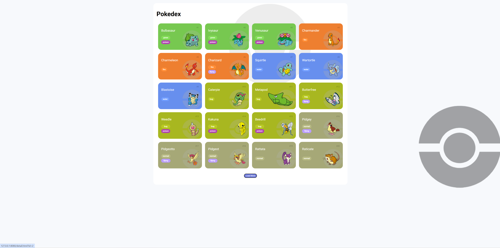
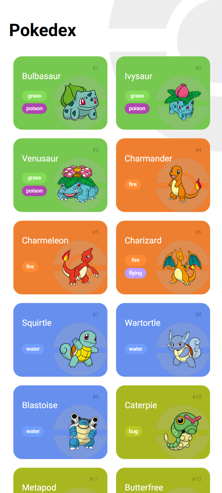

# 📘 Pokédex JavaScript

Uma Pokédex interativa construída com HTML, CSS e JavaScript, consumindo dados em tempo real da PokéAPI.

O projeto exibe uma lista de Pokémon e permite visualizar detalhes completos de cada um em uma interface inspirada no conceito criado por Saepul Nahwan no Dribbble.

## 🎨 Layout de Referência
O design utilizado como inspiração pode ser encontrado neste link:

- Design por: ["Saepul Nahwan"](https://dribbble.com/saepulnahwan23)
- Fonte: [Dribbble](https://dribbble.com/)

## 📸 Prévia

### Modelo

### Tela cheia

### Tela de Celular

## 🚀 Funcionalidades

- 🔍 Listagem de Pokémon com imagens e nomes.
- 📄 Página de detalhes com informações completas (tipo, stats, peso, altura etc).
- 🎨 Interface estilizada, moderna e responsiva.
- 🌐 Consumo da PokéAPI (API REST pública).
- ⚡ Navegação dinâmica utilizando JavaScript puro.

## 🛠️ Tecnologias Utilizadas

- HTML5
- CSS3
- JavaScript
- PokéAPI → https://pokeapi.co/

## 📦 Como Executar o Projeto

## 🎯 Objetivo do Projeto

Este projeto foi criado para praticar:

✔ Consumo de APIs REST
✔ Manipulação do DOM com JavaScript
✔ Criação de interfaces interativas
✔ Organização de componentes e estados
✔ Responsividade com CSS

## 🤝 Créditos

- Layout base criado por **Saepul Nahwan**
    👉 https://dribbble.com/saepulnahwan23

- Dados fornecidos por **PokéAPI**
    👉 https://pokeapi.co/

Este projeto como parte de um projeto educacional da Digital Innovation One.